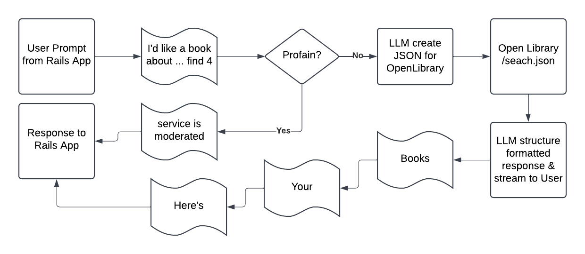

# Flask Application for Book Search

## Overview
This Flask application serves as a backend service for a Rails app to process user queries, filter profanity, generate structured search queries using an AI model (Ollama), fetch book data from the Open Library API, and refine the response with engaging narratives.

---

## Features
- **Profanity Detection**: Filters inappropriate user input using the `better_profanity` library.
- **AI Query Generation**: Uses Ollama AI to construct structured search queries.
- **Book Search**: Integrates with the Open Library API to fetch book data based on structured queries.
- **Response Refinement**: Uses AI to refine book search results into a user-friendly narrative.
- **Error Handling**: Handles API failures, invalid input, and profanity with appropriate error messages.

---

## Requirements
### Prerequisites
- Python 3.8+
- Flask
- Requests
- Better Profanity
- Ollama (for LLM integration)

### Installation
1. Clone the repository:
   ```bash
   git clone https://github.com/ktamulonis/openbook_service
   cd openbook_service
   ```
2. Create a virtual environment and activate it:
   ```bash
   python3 -m venv venv
   source venv/bin/activate  # On Windows: venv\Scripts\activate
   ```
3. Install dependencies:
   ```bash
   pip install -r requirements.txt
   ```

4. Install Ollama:
   - Follow instructions from the [Ollama Installation Guide](https://ollama.ai/).
   - Ensure you have access to the `llama3.2` model:
     ```bash
     ollama pull llama3.2
     ```
   - Start the Ollama service locally:
     ```bash
     ollama serve
     ```

---

## Running the Application
Start the Flask server:
```bash
python app.py
```
By default, the server runs on `http://localhost:5001`.

---

## API Endpoints
### **`POST /search-books`**
Handles book search requests.

#### Request Body:
```json
{
  "query": "string"
}
```
- `query`: User's search query (must be a non-empty string).

#### Response:
- **Success**: A streamed plain-text response with an engaging narrative and book details.
- **Error**: JSON object with an error message.

Example Error:
```json
{
  "error": "Invalid input. 'query' must be a non-empty string."
}
```

---

## Code Structure
### Main Components
1. **Input Validation**: Ensures user input is a valid non-empty string.
2. **Profanity Filtering**: Uses `better_profanity` to moderate input.
3. **AI Query Generation**:
   - Constructs a structured query using Ollama.
4. **Book Search**:
   - Queries the Open Library API using the structured query.
5. **Response Refinement**:
   - Uses Ollama to format the response into an engaging narrative.

---

## Error Handling
- **Invalid Input**: Returns a 400 error if the query is invalid or empty.
- **Profanity Detected**: Streams a message explaining the prohibition of profanity.
- **API Failures**: Returns a 500 error with details about the failed service.
- **Unexpected Errors**: Generic 500 error with a user-friendly message.

---

## Example Workflow
1. User submits a query, e.g., "books by J.K. Rowling."
2. Input is validated and filtered for profanity.
3. Ollama generates a structured query, e.g.,:
   ```json
   {
     "query_type": "author",
     "query_value": "J.K. Rowling",
     "limit": "3"
   }
   ```
4. Open Library API fetches book data based on the query.
5. Ollama refines the response into a narrative, e.g.,:
   ```text
   Here's what we found:
   • 'Harry Potter and the Philosopher's Stone' by J.K. Rowling
   • 'Harry Potter and the Chamber of Secrets' by J.K. Rowling
   • 'Fantastic Beasts and Where to Find Them' by J.K. Rowling
   Happy reading!
   ```

---

## Visual Workflow Representation
Below is a visual representation of the workflow for this application.



---

## Dependencies
- **Flask**: Web framework for handling HTTP requests.
- **Requests**: HTTP library for API calls.
- **Better Profanity**: Library for filtering inappropriate language.
- **Ollama**: LLM service for query generation and response refinement.

---

## Contributing
1. Fork the repository.
2. Create a feature branch:
   ```bash
   git checkout -b feature-name
   ```
3. Commit changes and push to the branch:
   ```bash
   git commit -m "Add feature name"
   git push origin feature-name
   ```
4. Open a pull request.

---

## License
This project is licensed under the MIT License. See the `LICENSE` file for details.

---

## Contact
For questions or suggestions, feel free to open an issue or reach out to the maintainer:
- **Email**: hackliteracy@gmail.com

---

## Acknowledgements
- [Flask](https://flask.palletsprojects.com/)
- [Open Library API](https://openlibrary.org/developers/api)
- [Ollama](https://ollama.ai/)
- [Better Profanity](https://pypi.org/project/better-profanity/)


